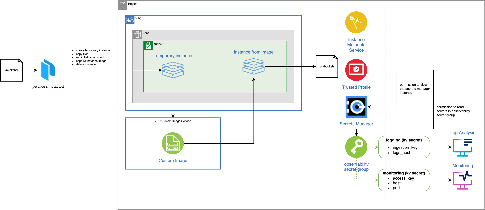

# A sample VPC custom image built with Packer

This example uses Packer to create a custom image and to provision a new virtual server instance from the custom image.



## Before you begin

To try this sample, you will need the latest versions of:
- [`packer`](https://www.packer.io/downloads)
- [`terraform`](https://www.terraform.io/downloads)
- [`ibmcloud`](https://cloud.ibm.com/docs/cli?topic=cli-getting-started) CLI and [`secrets-manager`](https://cloud.ibm.com/docs/secrets-manager?topic=secrets-manager-cli-plugin-secrets-manager-cli) plugin.
- or you can use the pre-built [`l2fprod/ibmcloud-ci`](https://github.com/l2fprod/ibmcloud-ci) image found in Docker Hub -- it has all required tools pre-installed.

## Build custom image and create new instance

1. Make sure you have one instance of the following services in the region where you plan to create resources:
   * [Secrets Manager](https://cloud.ibm.com/catalog/services/secrets-manager)
   * [Log Analysis](https://cloud.ibm.com/catalog/services/logdna)
   * [Monitoring](https://cloud.ibm.com/catalog/services/sysdig-monitor)
1. Copy template.local.env to local.env:
   ```
   cp template.local.env local.env
   ```
1. Edit `local.env` to match your environment. Use a unique basename name, e.g. by including the date.
1. (Recommended) Use the following Docker image to run the scripts.
   ```
   docker run -it --volume $PWD:/app --workdir /app l2fprod/ibmcloud-ci
   ```
   > Note: If running inside of Git Bash on Windows, prefix the above command with MSYS_NO_PATHCONV=1
1. Load the environment:
   ```
   source local.env
   ```
1. Deploy all resources:
   ```
   yes yes | ./doit.sh apply
   ```

At this stage, the script created a custom image and a new virtual server instance from this image. Terraform outputs the public IP address of the instance.

1. From your local machine (outside of the Docker container so `ssh` can retrieve your key), `ssh` to the sample virtual server using the IP address shown in the output, e.g `ssh root@123.45.67.89`
1. Check the content of `/etc/logdna.env` to find the Log Analysis agent host and ingestion key.
1. Check the content of `/opt/draios/etc/dragent.yaml` to find the Monitoring agent host and access key.
1. Open the dashboard of your Log Analysis instance to view logs coming from the virtual server.
1. Open the dashboard of your Monitoring instance and look under **Dashboard Templates / Host Infrastructure / 
Sysdig Agent Health & Status** to view data about the deployed agent. You can also explore the other dashboards under Host Infrastructure. Make sure you set the **hostname** in the scope to the created virtual server.
1. To remove all resources, including the custom image:
   ```
   yes yes | ./doit.sh destroy
   ```

## Code structure

| File or folder | Description |
| -------------- | ----------- |
| [010-iam-and-secrets](./010-iam-and-secrets/) | Terraform template to create a trusted profile, secret group and store Log Analysis and Monitoring credentials. |
| [020-prepare-custom-image](./020-prepare-custom-image/) | Terraform template to create the VPC and subnet required by Packer. |
| [030-custom-image](./030-custom-image/) | Packer configuration and scripts deployed to the custom image. |
| [040-create-instance](./040-create-instance/) | Terraform template to provision a server instance from the custom image. |

## License

Apache 2 Licensed. See [LICENSE](LICENSE) for full details.

The program is provided as-is with no warranties of any kind, express or implied.
